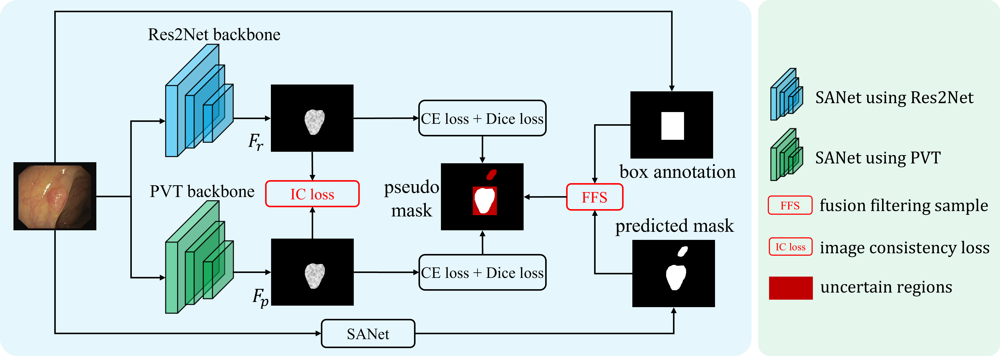
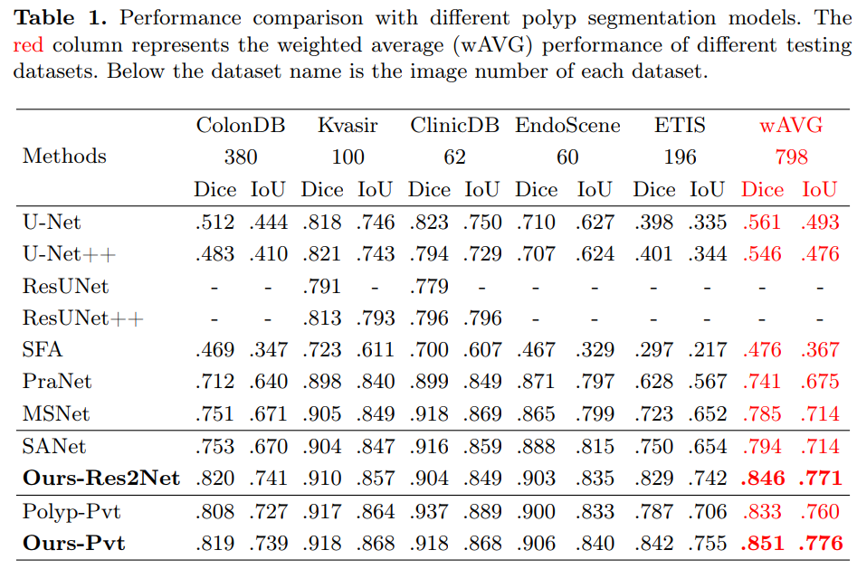
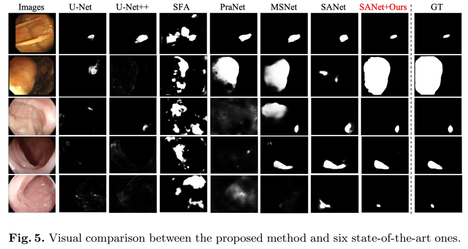

## [BoxPolyp: Boost Generalized Polyp Segmentation Using Extra Coarse Bounding Box Annotations](https://arxiv.org/pdf/2212.03498.pdf)
by Jun Wei, Yiwen Hu, Guanbin Li, Shuguang Cui, S Kevin Zhou, Zhen Li

## Introduction

Accurate polyp segmentation is of great importance for colorectal cancer diagnosis and treatment. However, due to the high cost of producing accurate mask annotations, existing polyp segmentation methods suffer from severe data shortage and impaired model generalization. Reversely, coarse polyp bounding box annotations are more accessible. Thus, in this paper, we propose a boosted BoxPolyp model to make full use of both accurate mask and extra coarse box annotations. In practice, box annotations are applied to alleviate the over-fitting issue of previous polyp segmentation models, which generate fine-grained polyp area through the iterative boosted segmentation model. To achieve this goal, a fusion filter sampling (FFS) module is firstly proposed to generate pixel-wise pseudo labels from box annotations with less noise, leading to significant performance improvements. Besides, considering the appearance consistency of the same polyp, an image consistency (IC) loss is designed. Such IC loss explicitly narrows the distance between features extracted by two different networks, which improves the robustness of the model. Note that our BoxPolyp is a plug-and-play model, which can be merged into any appealing backbone. Quantitative and qualitative experimental results on five challenging benchmarks confirm that our proposed model outperforms previous state-of-the-art methods by a large margin.

## Clone repository
```shell
git clone https://github.com/weijun88/BoxPolyp
cd BoxPolyp/
```

## Download dataset
The training and testing datasets come from [PraNet](https://github.com/DengPingFan/PraNet). Download these datasets and unzip them into `./dataset/Polyp/train` and `./dataset/Polyp/test`, respectively.
- [Training Dataset](https://drive.google.com/file/d/1lODorfB33jbd-im-qrtUgWnZXxB94F55/view?usp=sharing)
- [Testing Dataset](https://drive.google.com/file/d/1o8OfBvYE6K-EpDyvzsmMPndnUMwb540R/view?usp=sharing)

We also adopt an auxiliary dataset with box annotations from [LDPolypVideo](https://github.com/dashishi/LDPolypVideo-Benchmark). Download the `Test.rar` and `TrainValid.rar` and unzip them into `./dataset/LDPolyVideo` folder. Note that this dataset is auxiliary, we combine the training set and the testing set into a whole without making a distinction.
- [LDPolyVideo Dataset](https://drive.google.com/drive/folders/13KwU_uZcxsl6dL-mqcs39Yb0gjU9vn3G?usp=sharing)


## Download pretrained model
Two different backbone networks are adopted, please download these models into the `pretrain` folder
- [pvt_v2_b2](https://drive.google.com/drive/folders/1Eu8v9vMRvt-dyCH0XSV2i77lAd62nPXV?usp=sharing)
- [res2net50](https://drive.google.com/file/d/1_1N-cx1UpRQo7Ybsjno1PAg4KE1T9e5J/view?usp=sharing) 


## File tree
```
BoxPolyp                           
├─dataset
│  ├─LDPolypVideo
│  │  ├─bbox
│  │  └─image
│  └─Polyp
│      ├─test
│      │  ├─CVC-300
│      │  │  ├─image
│      │  │  └─mask
│      │  ├─CVC-ClinicDB
│      │  │  ├─image
│      │  │  └─mask
│      │  ├─CVC-ColonDB
│      │  │  ├─image
│      │  │  └─mask
│      │  ├─ETIS-LaribPolypDB
│      │  │  ├─image
│      │  │  └─mask
│      │  └─Kvasir
│      │      ├─image
│      │      └─mask
│      └─train
│          ├─image
│          └─mask
├─evaluate
│  └─prediction
│      ├─BoxPolyp-Pvt
│      │  ├─CVC-300
│      │  ├─CVC-ClinicDB
│      │  ├─CVC-ColonDB
│      │  ├─ETIS-LaribPolypDB
│      │  └─Kvasir
│      └─BoxPolyp-Res
│          ├─CVC-300
│          ├─CVC-ClinicDB
│          ├─CVC-ColonDB
│          ├─ETIS-LaribPolypDB
│          └─Kvasir
├─figure
├─network
├─pretrain
├─stage1
└─stage2
```

## Save color distribution
```shell
    cd dataset/
    python3 utils.py
```
- Calculate and save the color vectors of all the images of both Polyp dataset and LDPolypVideo dataset


## Training Stage1
```shell
    cd ../stage1
    python3 train.py
```
- Training the BoxPolyp model with only Polyp dataset


## Save pseudo masks of LDPolypVideo dataset
```shell
    python3 save.py
```
- Predicting the pseudo masks of LDPolypVideo with the model from Stage1. Remember to select the last saved model and change the path `self.snapshot`. After saving, these pseudo masks will be saved into `dataset\LDPolypVideo\mask`


## Training Stage2
```shell
    cd ../stage2
    python3 train.py
```
- Training the BoxPolyp model with both Polyp dataset and LDPolypVideo dataset

## Save predicitons of Polyp testing dataset
```shell
    python3 save.py
```
- Predicting the masks of Polyp testing dataset with the model from Stage2. Remember to select the last saved model and change the path `self.snapshot`. After saving, predictions of testing dataset will be saved into `evaluate\prediction`


## Evaluation
```shell
    cd ../evaluate
    matlab
    main
```
- To evaluate the performace of BoxPolyp, please use MATLAB to run `main.m`


## Performance & Visualization
- Quantitative comparisons 
- `wAVG` in Tab.1 is the weigthed average performance of different testing datasets 


- Qualitative comparisons 



## Citation
- If you find this work is helpful, please cite our paper
```
@inproceedings{BoxPolyp,
  title        = {BoxPolyp:Boost Generalized Polyp Segmentation Using Extra Coarse Bounding Box Annotations},
  author       = {Wei, Jun and Hu, Yiwen and Li, Guanbin and Cui, Shuguang and Zhou, S.Kevin and Li, Zhen},
  booktitle    = {International Conference on Medical Image Computing and Computer-Assisted Intervention},
  pages        = {67--77},
  year         = {2022},
  organization = {Springer}
}
```